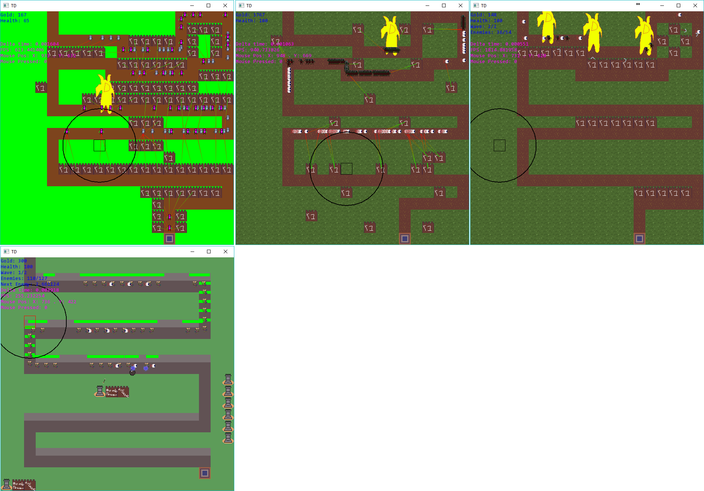

# Tower Defense
2D TD game in C++ with the SFML library.

## TODO

* ~~Tower cost~~
* ~~Base getting destroyed~~
* ~~Game\Menu State~~
* ~~Waves (Loaded from file etc)~~
* ~~Everything should use node~~
* ~~Projectiles~~
* ~~Buttons~~
* ~~Level Selection UI~~
* In Game UI
    * Buttons for selecting towers
    * Icons for gold and health
* Tower Upgrading
* Game Over UI
* Flying Enemies
* First 5 levels
* Update graphics again
* Add more enemy types
* Load enemy types from file

### Code Standards

Argument in class methods should just be the name, use this-> to differentiate between them. E.g `this->health = health`. No m\a prefixes to member variables.

### Code Structure

The entry point is in `main.cpp` but it just calls and uses `TD` found in `td.hpp\td.cpp` which inherits from `Game` found in `game.hpp\game.cpp`. The game is split into states:

* `menustate.hpp\cpp` - This renders\updates the menu
* `gamestate.hpp\cpp` - This renders\updates the game, the update is in a seperate method that is run on different thread
* `tileeditorstate.hpp\cpp` - This renders\updates the tile editor. 